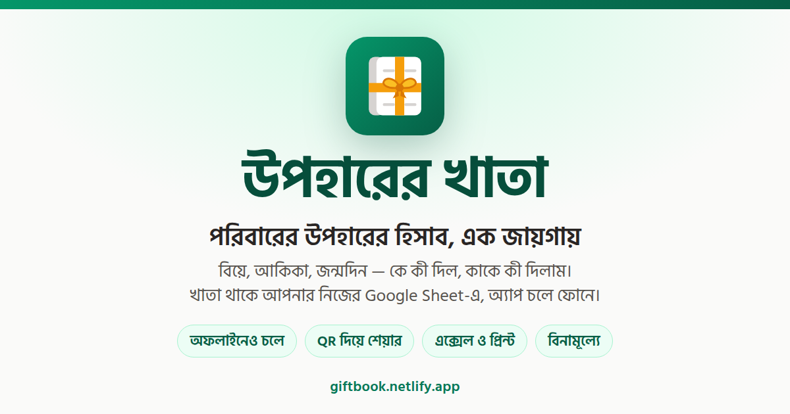
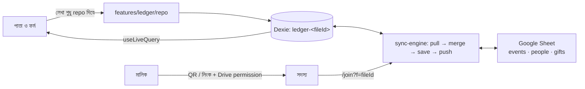

<p align="center"></p>

# উপহারের খাতা

> পরিবারের উপহারের হিসাব, এক জায়গায় — খাতা থাকে আপনার Google Sheet-এ, অ্যাপ চলে ফোনে, অফলাইনেও।

বিয়ে, গায়ে হলুদ, বউভাত, আকিকা, খতনা, জন্মদিন — কে কী দিল, কাকে কী দিলাম, খাম খোলা বাকি কটা: সব এক খাতায়। খাতাটা একটা সাধারণ Google Sheet, মালিকের নিজের Drive-এ; অ্যাপ শুধু নিজের বানানো শিটে ঢোকে (`drive.file`), বাকি Drive দেখে না। পরিবারের যে-কেউ QR স্ক্যান করে একই খাতায় লিখতে পারে। লেখা আগে ফোনে জমে, নেট থাকলে শিটে যায়।

**কার জন্য:** বাংলাভাষী পরিবার, যারা অনুষ্ঠানের উপহারের হিসাব কাগজের খাতার বদলে ফোনে রাখতে চায় — কিন্তু ডাটা নিজের Google অ্যাকাউন্টেই রাখতে চায়, কোনো তৃতীয় সার্ভারে নয়। পুরো UI বাংলায়, সংখ্যা বাংলা অঙ্কে, লাখ-হিসেবে কমা।

**[লাইভ অ্যাপ: giftbook.netlify.app](https://giftbook.netlify.app)** — Google দিয়ে সাইন ইন (OAuth অ্যাপ Testing মোডে: Audience-এ যোগ করা test user-রাই ঢুকতে পারবে)।



## কী কী করা যায়

- **অনুষ্ঠান** — নাম, ধরন (বিয়ে / গায়ে হলুদ / বউভাত / আকিকা / খতনা / জন্মদিন / অন্যান্য), তারিখ (পুরো তারিখ, শুধু মাস-সাল, বা শুধু সাল), জায়গা, নোট। হোমে প্রতিটি অনুষ্ঠানের কার্ডে পেলাম/দিলাম/খাম-বাকি সারাংশ।
- **উপহার** — পেলাম না দিলাম, কার কাছ থেকে/কাকে (নাম লাগবে, ফোন ঐচ্ছিক), টাকা **বা** জিনিস, নোট। দুটোই ফাঁকা রাখলে “খাম খোলা বাকি”। একটানা অনেক উপহার লেখার জন্য মডাল সেভের পরও খোলা থাকে। তালিকায় কলাম ধরে সর্ট, ২০টা করে পাতা, সব/পেলাম/দিলাম/খাম-বাকি ট্যাব।
- **মানুষ** — উপহার লিখলেই যোগ হয়; নাম/ফোন দিয়ে খোঁজা, ফোন নম্বর মিললে একই মানুষ ধরা, একই মানুষের দুটো এন্ট্রি **মার্জ**, প্রতিটি মানুষের সাথে সব অনুষ্ঠানের ইতিহাস ও ব্যবধান।
- **সিঙ্ক** — লেখার ৩ সেকেন্ড পর, প্রতি মিনিটে (ট্যাব দেখা গেলে), আর নেট ফিরলে। অবস্থা navbar-এ: সিঙ্ক হয়েছে / হচ্ছে / অফলাইন (কটা বাকি) / সিঙ্ক করতে চাপুন / খাতায় সমস্যা / অনুমতি নেই / সিঙ্ক বন্ধ।
- **শেয়ার** — মালিক QR বা লিংক দেয় (`/join?f=<fileId>`), শিটে Drive permission যোগ করে; সদস্য তালিকা ও সরানো। যে পেল, সে লিংক খুললে খাতাটা তার অ্যাপে যুক্ত হয় (সরাসরি না মিললে Google Picker দিয়ে একবার বেছে নিতে হয়)।
- **এক্সেল ও প্রিন্ট** — এক অনুষ্ঠানের বা পুরো খাতার `.xlsx`; অনুষ্ঠানের প্রিন্ট-পাতা (`/events/<id>/print`)।
- **PWA** — হোম স্ক্রিনে ইনস্টল, অফলাইনে খোলে, ফোনের কপি Dexie (IndexedDB)-তে।
- **তিন লেআউট** — মোবাইলে নিচে ট্যাব + FAB, ট্যাবলেট/ডেস্কটপে উপরে কেন্দ্রীয় মেনু; প্রতিটি পাতার নিজস্ব স্কেলেটন লোডার।

## কীভাবে কাজ করে



- শিটে তিনটা ট্যাব (`events`, `people`, `gifts`); কলামের ক্রম Zod স্কিমা থেকে আসে (`src/features/ledger/schema.ts`)। প্রথম N কলামের হেডার বদলালে অ্যাপ “খাতায় সমস্যা” দেখিয়ে সিঙ্ক থামায়, শিটে কিছু লেখে না; ডানে বাড়তি কলাম যোগ করলে সমস্যা নেই।
- দুই ফোনে একই সারি বদলালে `updatedAt` যারটা পরে, সেটা জেতে (last-write-wins)। মোছা মানে `deletedAt` বসানো — শিটে সারি থেকে যায়।
- Append শিটে লেগে গেল কিন্তু কল ব্যর্থ হলো — পরের চক্রে ডুপ্লিকেট হয় না; শিটে একই id দুবার থাকলে প্রথম সারিটাই আপডেট হয়। এগুলো `src/test/sync.test.ts`-এর ৯টা টেস্টে ধরা।
- Google-এর জায়গায় localStorage **মক** আছে (অ্যাকাউন্ট চুজার, Drive, Picker, Sheets) — একই ইন্টারফেস (`src/features/google/types.ts`), বাছাই `src/features/google/index.ts`-এ। তাই credential ছাড়াই পুরো ওয়ার্কফ্লো চালানো ও পরীক্ষা করা যায়।

## চালানো

**লাগবে:** Node.js ≥ 22.12, pnpm 11.7 (`package.json` → `engines`, `packageManager`)। আসল Google মোডের জন্য একটা Google Cloud প্রজেক্ট (নিচে)।

### ১. ইনস্টল

```bash
pnpm install
```

### ২. মক মোডে চালাও (credential লাগে না)

```bash
pnpm dev:mock
```

http://localhost:3101 খুলুন। লগইন পাতায় নীল নোট “ডেমো মোড: Google ছাড়া চলছে” দেখলে মক মোড চলছে — যেকোনো জিমেইল লিখে ঢুকুন → খাতা বানান → অনুষ্ঠান → উপহার। সেটিংসে “নমুনা ডাটা ভরো”, সিঙ্ক-সিমুলেশন (অফলাইন / টোকেন ফুরানো / কলাম বদল) আর “সব মুছে ফেলো” পাবেন। দুই ব্রাউজার প্রোফাইলে দুই জিমেইল দিয়ে শেয়ার-ওয়ার্কফ্লো পরীক্ষা করা যায়।

### ৩. আসল Google দিয়ে (secrets Infisical থেকে)

সব environment variable Infisical প্রজেক্ট **giftbook**-এ (`.infisical.json` → workspaceId; env: `dev` / `staging` / `prod`)। লোকাল `.env` লাগে না।

```bash
npm i -g @infisical/cli
infisical login
pnpm dev          # = infisical run --env=dev -- vite dev --port 3100
```

| ভেরিয়েবল | কী | কোথা থেকে |
| --- | --- | --- |
| `VITE_GOOGLE_CLIENT_ID` | OAuth 2.0 Client ID (Web) | Google Cloud → APIs & Services → Credentials |
| `VITE_GOOGLE_API_KEY` | API key, শুধু Picker API-তে সীমাবদ্ধ | Credentials |
| `VITE_GOOGLE_APP_ID` | প্রজেক্টের **number** (ID নয়) — Picker-এর `setAppId` | Cloud overview / Project settings |
| `VITE_GOOGLE_MOCK` | `1` = মক; অন্য কিছু = আসল Google | — |
| `VITE_SITE_URL` | প্রোডাকশন origin (`https://…`, শেষে `/` ছাড়া) — সোশ্যাল প্রিভিউর absolute URL-এর জন্য, বিল্ডের সময় | — |

Infisical ছাড়া চালাতে চাইলে `cp .env.example .env` করে মান বসিয়ে `pnpm exec vite dev --port 3100`। `VITE_GOOGLE_CLIENT_ID` ফাঁকা থাকলেও মক মোড চলে; `.env.mock` (`VITE_GOOGLE_MOCK=1`) `dev:mock` স্ক্রিপ্ট নিজেই নেয়। `.env*` gitignored।

Google Cloud-এ একবার (বিস্তারিত [docs/PLAN.md](docs/PLAN.md) §২):

1. Sheets API, Drive API, Picker API চালু।
2. OAuth consent screen: External, Testing; scope শুধু `https://www.googleapis.com/auth/drive.file`; Audience-এ পরিবারের জিমেইলগুলো **test user** হিসেবে যোগ (Testing মোডে শুধু তারাই লগইন করতে পারবে)।
3. OAuth Client ID (Web): Authorized JavaScript origins-এ `http://localhost:3100` + প্রোড ডোমেইন।
4. API key: শুধু Picker API; HTTP referrer `http://localhost:3100/*` + প্রোড ডোমেইন।

http://localhost:3100 → “Google দিয়ে সাইন ইন” → Google পপআপ (ব্যবহারকারীর ক্লিকে) → `/setup`-এ Drive-এ খাতা খোঁজা / নতুন খাতা → খাতা বানালে আপনার Drive-এ শিট তৈরি হয় আর হোমে আসেন।

### কমান্ড

| কমান্ড | কী করে |
| --- | --- |
| `pnpm dev` | `infisical run --env=dev` → dev সার্ভার, পোর্ট 3100 |
| `pnpm dev:mock` | dev সার্ভার, পোর্ট 3101, `--mode mock` (`.env.mock`) |
| `pnpm build` | প্রোডাকশন বিল্ড → `dist/client` (SPA shell `_shell.html` + PWA); env যে দেয়, তার |
| `pnpm build:prod` | `infisical run --env=prod` → বিল্ড |
| `pnpm deploy` | `build:prod` + `netlify deploy --prod --no-build --dir dist/client` |
| `pnpm preview` | বিল্ড প্রিভিউ |
| `pnpm typecheck` | `tsc --noEmit` |
| `pnpm lint` | ESLint (`@tanstack/eslint-config`) |
| `pnpm format` | Prettier (Tailwind ক্লাস সর্ট সহ) |
| `pnpm test` | `node --test` — সিঙ্কের rows / merge / cycle, ৯টা |
| `pnpm generate-routes` | TanStack Router রুট-ট্রি রিজেনারেট |

`pnpm-workspace.yaml`-এ `allowBuilds: unrs-resolver: true` — নইলে pnpm-এর ignored-builds চেক প্রতিটি `pnpm run`-এ আটকে দেয়।

## কাঠামো

```
src/
├─ routes/            __root (head: মেটা + সোশ্যাল প্রিভিউ) · index (ল্যান্ডিং, /) · login · setup · join · privacy · contact · _app (guard + shell)
│                     _app/{events.index (অ্যাপের হোম /events), events.$eventId, people.index, people.$personId, share, settings} · events.$eventId.print
├─ components/ui/     shadcn (radix-nova; আইকন Hugeicons)
├─ components/common/ app-shell · nav · user-menu · page-header · skeletons · pagination · responsive-dialog · confirm-dialog · field · sync-status · sync-banner · ledger-gate …
├─ features/
│  ├─ auth/           session (localStorage) · activate
│  ├─ google/         types · gfetch · real/{auth,drive,sheets,picker} · mock/{store,auth,drive,sheets,picker,ui}
│  ├─ ledger/         schema (Zod; কলামের ক্রম) · db (Dexie per fileId) · repo (লেখার একমাত্র দরজা) · queries · hooks · seed
│  ├─ sync/           rows · merge · sync-cycle · dexie-adapter · sync-engine
│  ├─ events/ gifts/ people/ sharing/ export/
├─ config/            env (Zod) · site (মেটাডাটা) · icons · event-types · nav
├─ lib/               i18n/bn (সব লেখা) · format (টাকা, তারিখ, বাংলা অঙ্ক, ফোন) · focus · utils
└─ test/              sync.test.ts
brand/                og.html (সোশ্যাল প্রিভিউ টেমপ্লেট) · render.sh
public/               logo.svg · favicon.svg · favicon.ico · favicon-32.png · icon-192/512.png · apple-touch-icon.png · og-v2.png
docs/                 PLAN.md (v2, এই অ্যাপের স্পেক) · PLAN-v1.md · QA-REPORT.md · GAP-ANALYSIS.md · PROTOTYPE-README.md
```

নিয়ম: লেখা শুধু `repo` দিয়ে (সে `updatedAt`/`updatedBy` বসায়), পড়া `queries` + hooks; সব লেখা `bn.ts`-এ, আইকন `icons.ts`-এ, ফরম্যাট `format.ts`-এ; ফর্ম `noValidate`, এরর বাংলায় ফিল্ডের নিচে; `components/ui` হাতে বদলানো নয়।

## ব্র্যান্ড ও সোশ্যাল প্রিভিউ

লোগো: উপহারের ফিতায় বাঁধা খাতা — `public/logo.svg` উৎস; তা থেকেই favicon (ico/png/svg), PWA আইকন, apple-touch-icon। সোশ্যাল কার্ড (Open Graph / Twitter, 1200×630) `brand/og.html` থেকে রেন্ডার করা `public/og-v2.png`; মেটাট্যাগ `src/config/site.ts` → `src/routes/__root.tsx`, বিল্ডে `_shell.html`-এ প্রি-রেন্ডার হয় (সব রুট একই কার্ড)। রাস্টার আবার বানাতে (google-chrome লাগে):

```bash
bash brand/render.sh
```

কার্ড বদলালে ফাইলের নাম বাড়াও (`og-v3.png`) আর `site.ts`-এ বদলাও — মেসেজিং অ্যাপের ক্রলার পুরোনো URL ক্যাশ করে রাখে।

## ডিপ্লয়

লাইভ সাইট: Netlify প্রজেক্ট `giftbook` → https://giftbook.netlify.app।

**ম্যানুয়াল ডিপ্লয় (এখন যেভাবে হয়):**

```bash
pnpm deploy
```

Infisical `prod` env থেকে secrets নিয়ে লোকালে বিল্ড, তারপর `dist/client` আপলোড (Netlify-র build minute খরচ হয় না; Netlify CLI `npx` দিয়ে, লগইন `netlify login` একবার)।

`netlify.toml`-এ পরিচিত রুটগুলো `_shell.html`-এ 200 rewrite, অজানা পাথ একই shell কিন্তু **HTTP 404** (অ্যাপ নিজের ৪০৪ পাতা দেখায়)। নতুন টপ-লেভেল রুট যোগ করলে সেখানে একটা rule যোগ করো।

**Netlify remote build (git যুক্ত করলে):** `netlify.toml`-এর build command Infisical CLI ইনস্টল করে machine identity দিয়ে লগইন করে `infisical run --env=prod -- pnpm build` চালায়। Netlify env-এ লাগে:

| Netlify env | কী |
| --- | --- |
| `INFISICAL_PROJECT_ID` | Infisical প্রজেক্ট আইডি (public; সেট করা আছে) |
| `INFISICAL_UNIVERSAL_AUTH_CLIENT_ID` | machine identity-র Client ID — Infisical: Organization → Access Control → Identities → Universal Auth; প্রজেক্ট giftbook-এ `prod` read access |
| `INFISICAL_UNIVERSAL_AUTH_CLIENT_SECRET` | ওই identity-র Client Secret (secret হিসেবে মার্ক করুন) |

`VITE_*` কোনো মান Netlify-তে রাখার দরকার নেই — সব Infisical থেকে আসে। `VITE_SITE_URL` না থাকলে og:image/og:url root-relative হয়, যা WhatsApp/Facebook-এর ক্রলার নেয় না। Google Console-এ প্রোড ডোমেইন OAuth client-এর origins আর API key-র referrer-এ যোগ করা আছে।

## সীমা ও সতর্কতা

- **ডাটা আপনার Drive-এ।** অ্যাপের নিজের কোনো সার্ভার বা ডাটাবেস নেই; শিটটাই ব্যাকআপ। শিট হাতে এডিট করা যায়, কিন্তু হেডার/কলামের ক্রম বদলালে সিঙ্ক থামে।
- **Testing-মোড OAuth:** শুধু Audience-এ যোগ করা test user-রা লগইন করতে পারবে। টোকেন মেয়াদ ফুরালে navbar-এ “সিঙ্ক করতে চাপুন” — লেখা ফোনে জমে থাকে।
- **শেয়ার শুধু মালিক করতে পারে।** সদস্য সরালে তার ফোনের কপি থেকে যায় কিন্তু শিটে আর কিছু যায় না (“অনুমতি নেই” ব্যানার)।
- **সেশন ও টোকেন** ব্রাউজারের localStorage-এ (`uk-session`, `uk-token`); লগ আউট করলে মুছে যায়, ফোনের কপি থাকে।
- **সিঙ্ক = last-write-wins;** একই উপহার দুজনে একসাথে বদলালে পরে সেভ করাটা থাকে, মার্জ হয় না।
- **যাচাইয়ের অবস্থা:** পুরো ওয়ার্কফ্লো মক মোডে পরীক্ষিত; আসল Google-এ লগইন, খাতা তৈরি ও শিটে সিঙ্ক পরীক্ষিত। আসল মোডে QR-শেয়ার → join → Picker পথটা এখনো দুই আলাদা Google অ্যাকাউন্ট দিয়ে পরীক্ষা করা হয়নি।
- **ইচ্ছে করে বাদ** (`docs/PLAN.md` শেষ অংশ): অ্যাপের ভেতরের QR স্ক্যানার (ফোনের ক্যামেরা অ্যাপই স্ক্যান করে), সার্ভার-সাইড OAuth, একাধিক খাতা একসাথে, পিন লক, ছবি থেকে লেখা তোলা।

## ডকুমেন্ট

- [docs/PLAN.md](docs/PLAN.md) — ইমপ্লিমেন্টেশন প্ল্যান v2 (স্পেক), Google Cloud সেটআপ, ডিজাইন টোকেন, চেকলিস্ট
- [docs/QA-REPORT.md](docs/QA-REPORT.md) — QA/UX অডিট ও ফিক্স তালিকা (রিগ্রেশন চেকলিস্ট)
- [docs/GAP-ANALYSIS.md](docs/GAP-ANALYSIS.md) — প্ল্যান বনাম প্রোটোটাইপ
- [docs/PROTOTYPE-README.md](docs/PROTOTYPE-README.md) — HTML প্রোটোটাইপ (এই রেপোর বাইরে, `../upohar-khata/`) চালানোর বর্ণনা
- [docs/PLAN-v1.md](docs/PLAN-v1.md) — মূল প্ল্যান + রিভিউ নোট
- [.env.example](.env.example) — সব environment variable, ব্যাখ্যাসহ (উৎস Infisical; লোকাল `.env` ঐচ্ছিক)

## লাইসেন্স

এই রেপোতে কোনো লাইসেন্স ফাইল নেই (`package.json`-এ `private: true`)। কোড পুনর্ব্যবহারের অনুমতি দেওয়া হয়নি।
